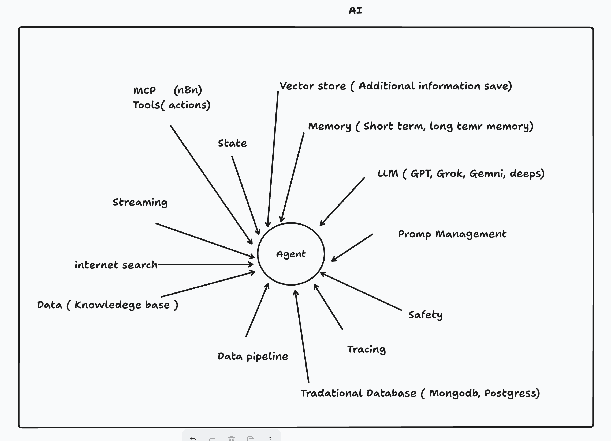

# Getting Started with Poetry and FastAPI

## Poetry Configuration and Installation

### Install Poetry
- Use the official installer for Poetry:
  ```bash
  curl -sSL https://install.python-poetry.org | python3 -
  ```
- On Windows (using PowerShell):
  ```powershell
  (Invoke-WebRequest -Uri https://install.python-poetry.org -UseBasicParsing).Content | py -
  ```

### Install Project Dependencies
- To install all dependencies for an already created project:
  ```bash
  poetry install --no-root
  ```

### Create a New Project
- To initialize a new Poetry project:
  ```bash
  poetry init
  ```

### Manage Dependencies
- To add a new dependency:
  ```bash
  poetry add <package-name>
  ```
- To remove a dependency:
  ```bash
  poetry remove <package-name>
  ```

---

## Installing FastAPI and Uvicorn
- Add FastAPI with standard dependencies:
  ```bash
  poetry add "fastapi[standard]"
  ```
- Add Uvicorn (ASGI server):
  ```bash
  poetry add uvicorn
  ```

---

## Running Files

### Run with Python
- Use `poetry run` to execute Python scripts:
  ```bash
  poetry run python <relative-path-to-file>
  ```
  Example:
  ```bash
  poetry run python 07-llm-and-prompt-engineering/01_gemeni_llm.py
  ```

### Run with FastAPI/Uvicorn
- Use `poetry run` with Uvicorn to serve FastAPI applications:
  ```bash
  poetry run uvicorn <relative-path-to-module>:app --reload
  ```
  - Replace `/` with `.` in the path, and change `.py` to `:app`.
  - Example:
    ```bash
    poetry run uvicorn 09-langgraph.websocket-agent.ws_agent_server_gemini:app --reload
    ```

---


## Course Outline
### Course Outline: Cloud-Native Applied AI Agentic Developer

1. **Python Foundations**
   - Overview of Python for AI development
   - Essential libraries and best practices

2. **AI Theory & Terminologies**
   - Key AI concepts and definitions
   - Understanding machine learning, deep learning, and reinforcement learning
   - Ethics and bias in AI

3. **FastAPI**
   - Introduction to FastAPI for building APIs
   - Designing, implementing, and testing AI-powered APIs

4. **Databases**
   - **SQL Databases**: Basics and advanced queries
   - **NoSQL Databases**: Understanding document, key-value, and graph databases

5. **Third-Party Libraries**
   - **NumPy**: Numerical computing
   - **Pandas**: Data manipulation and analysis
   - **OpenCV**: Computer vision basics and applications

6. **Model Development Lifecycle**
   - Model building and training using **Keras**
   - Data preprocessing, validation, and evaluation
   - Deploying AI models

7. **Large Language Models (LLMs)**
   - Overview of LLMs: **Gemini**, **OpenAI**, and **Allama**
   - Selecting the right LLM for applications

8. **LLM Framework: LangChain**
   - Building applications with LangChain
   - Advanced techniques for chaining and managing LLMs

9. **Agentic Framework: LangGraph**
   - Overview and integration with LangChain
   - Developing agentic systems for AI workflows

10. **Agentic Framework: CrewAI**
   - Overview and integration with Mulit Ai Agents
   - Developing agentic systems for AI workflows

11. **Cloud Computing & DevOps**
    - **Docker**: Containerizing AI applications
    - **Kubernetes**: Orchestrating containers at scale
    - Managing deployments in cloud-native environments

12. **Frontend Development with Next.js**
    - Designing chatbot UIs
    - Building interactive agent frontends for seamless user experience

This structured course ensures a comprehensive journey from fundamental concepts to advanced cloud-native AI development, emphasizing both backend and frontend technologies.


### Agents

